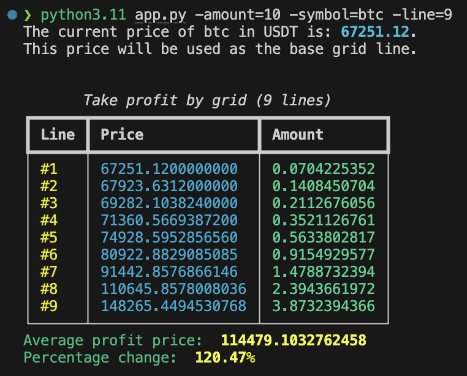

  

<h4 align="center">A tool for taking profit using grid with Fibonacci</h4>

## Install guide

- Install conda
- Run: conda install --yes --file requirements.txt

## Run guide

- Run for BTC current price example: python app.py -symbol=btc -line=8 -amount=5
- Run for any price example: python app.py -price=3000 -line=8 -amount=2
